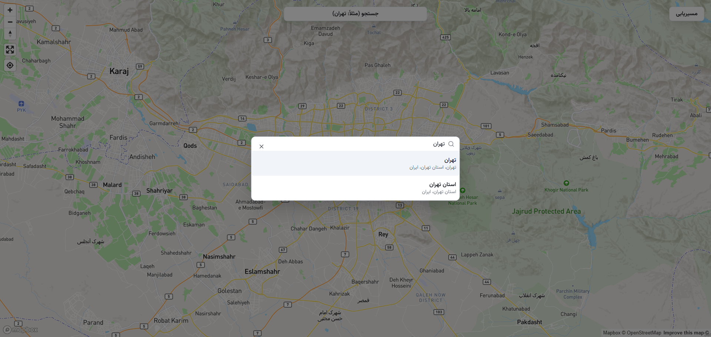
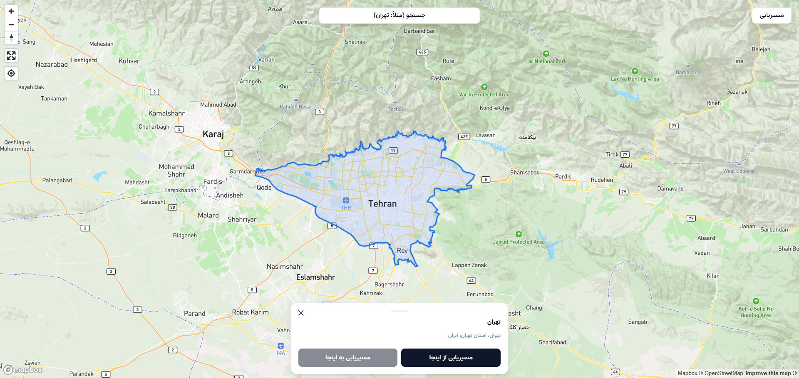

# اپلیکیشن مسیریابی بهینه (Optimal Routing App)

این پروژه یک اپلیکیشن وب برای پیدا کردن مسیر بهینه بین دو نقطه بر روی نقشه است که با استفاده از سرویس‌های Mapbox و با تمرکز بر یک رابط کاربری مدرن و واکنش‌گرا پیاده‌سازی شده است.

---

## 🚀 Live Demo (مشاهده دمو)

**[شما می‌توانید نسخه زنده‌ی این پروژه را در Vercel مشاهده کنید](https://optimal-routing-app.vercel.app/)**

---

## 📸 Screenshots (تصاویر پروژه)

| نمای اصلی اپلیکیشن (جستجو و نمایش مسیر) | اطلاعات مسیر و نقاط میانی |
| :-----------------------------------------: | :---------------------------------------: |
|  |  |

---

**[برای مشاهده گالری کامل تصاویر پروژه کلیک کنید](./screenshots)**

## Features (ویژگی‌ها)

- **نقشه تعاملی:** نمایش نقشه با استفاده از `Mapbox GL JS` با قابلیت جابجایی و زوم.
- **جستجوی آدرس و مکان:** قابلیت جستجوی مکان‌های مختلف با استفاده از سرویس `Mapbox Geocoding` و نمایش نتایج به صورت لحظه‌ای.
- **انتخاب مبدا، مقصد و نقاط میانی:**
  - امکان انتخاب نقاط از طریق کلیک مستقیم روی نقشه.
  - امکان انتخاب نقاط از طریق لیست نتایج جستجو.
- **محاسبه مسیر بهینه:** دریافت و نمایش بهینه‌ترین مسیر رانندگی بین نقاط انتخاب شده با استفاده از `Mapbox Directions API`.
- **نمایش اطلاعات مسیر:** نمایش جزئیات کامل مسیر شامل **مسافت کل** و **زمان تخمینی سفر**.
- **مدیریت وضعیت با Zustand:** مدیریت وضعیت گلوبال برنامه (نقاط انتخاب شده، اطلاعات مسیر، وضعیت بارگذاری) با `Zustand` به شکلی ساده و کارآمد.
- **رابط کاربری مدرن و واکنش‌گرا:** طراحی شده با **Tailwind CSS** و کامپوننت‌های آماده از **shadcn/ui** برای تجربه‌ی کاربری بهتر در دستگاه‌های مختلف.

---

## Tech Stack (تکنولوژی‌های استفاده شده)

- **React & Vite:** به عنوان فریمورک اصلی و ابزار ساخت (Build Tool) سریع پروژه.
- **TypeScript:** برای نوع‌بندی (Type-Safety) قوی و توسعه‌پذیری بهتر.
- **Tailwind CSS & shadcn/ui:** برای پیاده‌سازی سریع یک رابط کاربری مدرن، خوانا و کاملاً واکنش‌گرا.
- **Mapbox GL JS & React Map GL:** برای نمایش نقشه و تعامل با آن در محیط React.
- **Zustand:** برای مدیریت وضعیت (State Management) ساده، بهینه و بدون نیاز به Boilerplate زیاد.
- **pnpm:** به عنوان مدیر بسته (Package Manager) سریع و بهینه در مصرف فضا.

---

## Architecture Notes (توضیح معماری)

ساختار این پروژه بر اساس جداسازی منطقی کامپوننت‌ها، سرویس‌ها و مدیریت وضعیت طراحی شده است:

- **`src/components/features/map/`**: کامپوننت‌های اصلی که منطق اصلی برنامه را در بر دارند، مانند `MapBox` (رندر نقشه)، `GeocodeSearch` (باکس جستجو) و `RoutePanel` (نمایش اطلاعات مسیر).
- **`src/components/ui/`**: کامپوننت‌های پایه و اتمی (مانند `Button`, `Dialog`, `Command`) که توسط `shadcn/ui` مدیریت می‌شوند و در سراسر برنامه استفاده شده‌اند.
- **`src/services/`**: ماژول‌های مربوط به ارتباط با سرویس‌های خارجی Mapbox. هر سرویس (مانند `mapbox-directions`, `mapbox-geocoding`) در فایل جداگانه‌ای کپسوله شده است.
- **`src/store/`**: منطق مدیریت وضعیت برنامه با Zustand. فایل `use-map-store.ts` تمام وضعیت‌های مربوط به نقشه، نقاط و مسیر را مدیریت می‌کند.
- **`src/lib/`**: شامل توابع کمکی و ابزارهای عمومی پروژه، مانند فرمت کردن زمان و مسافت.

---

## Get Started (راه‌اندازی پروژه)

### 1. پیش‌نیازها

- Node.js (v18.x or later)
- pnpm (یا npm/yarn)

### 2. نصب و راه‌اندازی

1.  **کلون کردن مخزن:**

    ```bash
    git clone https://github.com/masoudkaarimi/optimal-routing-app.git
    cd optimal-routing-app
    ```

2.  **نصب وابستگی‌ها:**

    ```bash
    pnpm install
    ```

3.  **پیکربندی متغیرهای محیطی:**

    یک فایل به نام `.env.local` در ریشه پروژه ایجاد کرده و کلید دسترسی Mapbox خود را در آن قرار دهید. می‌توانید از فایل `example.env.local` کپی کنید.

    ```.env.local
    VITE_MAPBOX_ACCESS_TOKEN="YOUR_MAPBOX_ACCESS_TOKEN"
    ```
    > **نکته:** برای دریافت کلید دسترسی، به وب‌سایت [Mapbox](https://www.mapbox.com/) مراجعه کرده و یک حساب کاربری رایگان بسازید.

4.  **اجرای سرور توسعه:**

    ```bash
    pnpm dev
    ```

5.  برنامه اکنون در آدرس `http://localhost:5173` (یا پورت دیگر) قابل مشاهده است.

